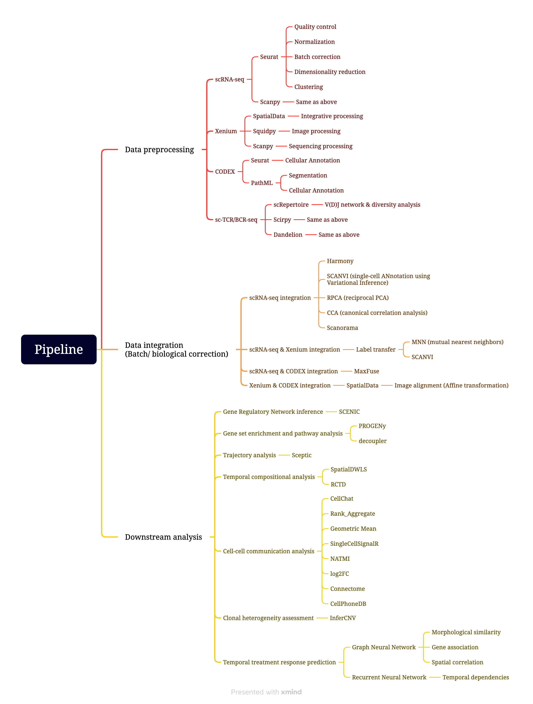

# ADvanced machine learning-Assisted Precision Treatment Strategy

We aim to establish a machine learning-based platform to assist the precision treatment.

The pipeline would integrate many widely used packages to conduct the integrative analysis. The sematic schema is drafted below.

